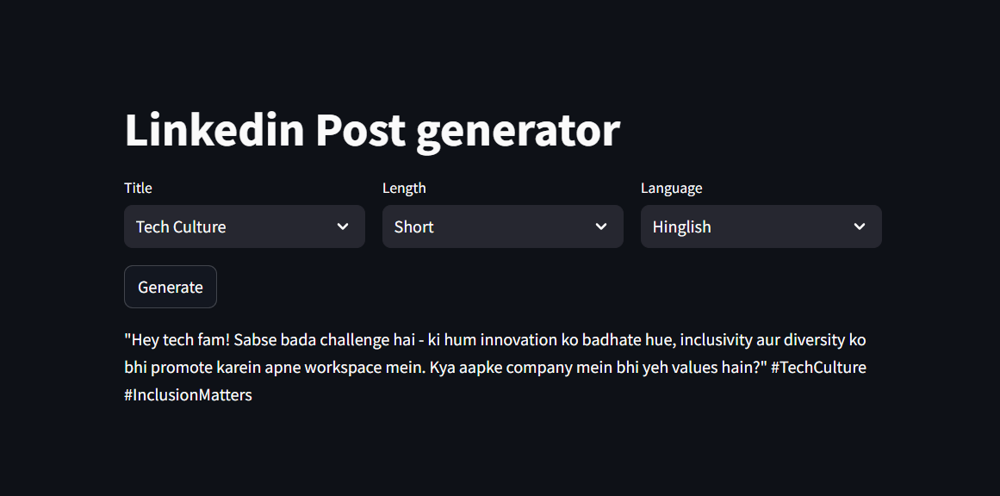
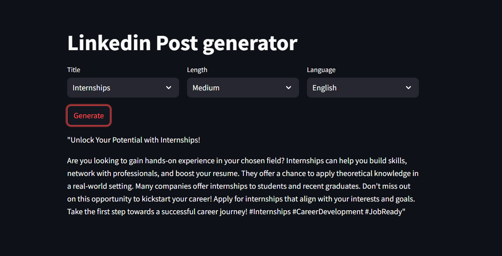

# 🚀 LinkedIn Post Generator

An AI-powered tool that generates LinkedIn posts based on your preferences for length, language, and topic tags. This project uses machine learning to analyze existing posts and generate new, relevant content.

 

## ✨ Features

- **Smart Post Generation**: AI-powered content creation based on existing LinkedIn posts
- **Customizable Parameters**: Choose from different lengths, languages, and topics
- **Tag-based Filtering**: Select from automatically extracted and unified tags
- **Multi-language Support**: English, Hinglish (Hindi + English), and Hindi
- **Interactive Web Interface**: Easy-to-use Streamlit application

## 🚀 Quick Start

### Prerequisites

- Python 3.8 or higher
- pip (Python package manager)

### Installation

1. **Clone the repository**
   git clone https://github.com/shrutiiiiin/LinkedinPostGenerator.git
   cd linkedin-post-generator
2. **Install dependencies**
   pip install -r requirements.txt
3. **Setup your data**
    python process_posts.py
4. **Configure your LLM**
    Update llm_helper.py with your AI model configuration
    Add your API keys if using external services
5. **Run the Application**
    streamlit run main.py